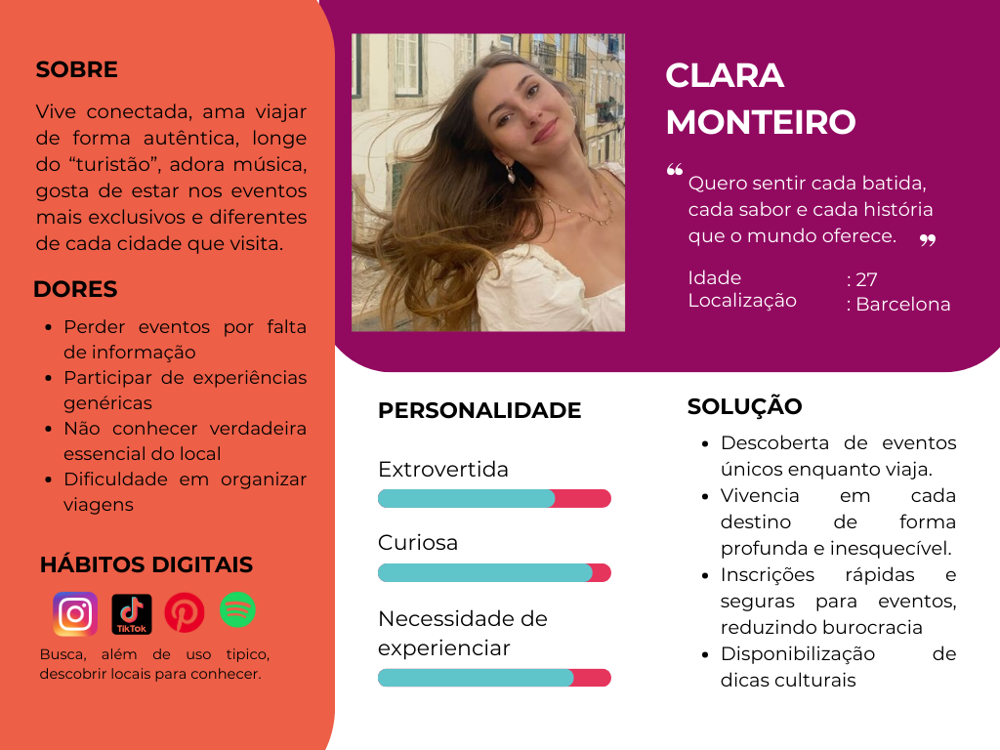

# Web Application Document - Projeto Individual - Módulo 2 - Inteli

## Vibra

#### Aira Mel 

## Sumário

1. [Introdução](#c1)  
2. [Visão Geral da Aplicação Web](#c2)  
3. [Projeto Técnico da Aplicação Web](#c3)  
4. [Desenvolvimento da Aplicação Web](#c4)  
5. [Referências](#c5)  

 

## 1. Introdução (Semana 01)

&emsp;A aplicação web **Vibra** nasce da necessidade de oferecer uma experiência moderna, prática e escalável para viajantes e amantes da música. Utilizando apenas uma conexão com a internet, os usuários poderão acessar e gerenciar serviços de qualquer lugar do mundo, promovendo uma verdadeira imersão cultural.

&emsp;O **Vibra** é uma plataforma de eventos com gerenciamento de inscrições, criada para facilitar a conexão entre pessoas e experiências únicas ao redor do mundo. Desenvolvido especialmente para quem ama viajar e viver intensamente cada destino, o aplicativo recomenda eventos exclusivos baseados na localidade da viagem, como tours gastronômicos na Itália, aulas de samba no Rio de Janeiro e corridas emblemáticas em Mônaco.

&emsp;Além disso, a plataforma oferece uma área dedicada a informações culturais rápidas, dicas práticas, idiomas locais e costumes, para preparar o viajante antes de cada experiência. Com o **Vibra**, viajar vai além de conhecer lugares: é viver momentos inesquecíveis, com tudo o que importa na palma da mão.

---

## 2. Visão Geral da Aplicação Web

### 2.1. Personas (Semana 01)

Figura 1 - Persona - Vibra 

Fonte: Autoria Própia, Faculdade Inteli 2025

### 2.2. User Stories (Semana 01)

> US01 | Como turista, quero descobrir eventos únicos enquanto viajo, para que eu possa viver cada destino profundamente e inesquecível.

> US02 | Como uma usuária que valoriza praticidade, quero me inscrever em eventos de forma rápida e segura, para garantir minha participação sem complicações e evitar filas ou processos demorados.

> US03 | Como uma amante de viagens culturais, quero receber recomendações de eventos, festas e atividades locais baseadas no meu perfil e destino, para otimizar minha experiência e tornar cada viagem inesquecível.

INVEST US02
**I - Independente**: O sistema de inscrição pode ser desenvolvido separado da descoberta de eventos.

**N - Negociável**: O fluxo de inscrição pode ser ajustado (por exemplo: via app, QR code, confirmação por email).

**V - Valiosa**: Inscrição fácil aumenta a adesão aos eventos.

**E - Estimável**: Consegue-se estimar fluxo de inscrição.

**S - Small**: É um pedaço pequeno e objetivo.

**T - Testável**: Pode-se testar simulando inscrições em eventos.

---

## 3. Projeto da Aplicação Web

### 3.1. Modelagem do banco de dados  (Semana 3)

*Posicione aqui os diagramas de modelos relacionais do seu banco de dados, apresentando todos os esquemas de tabelas e suas relações. Utilize texto para complementar suas explicações, se necessário.*

*Posicione também o modelo físico com o Schema do BD (arquivo .sql)*

### 3.1.1 BD e Models (Semana 5)
*Descreva aqui os Models implementados no sistema web*

### 3.2. Arquitetura (Semana 5)

*Posicione aqui o diagrama de arquitetura da sua solução de aplicação web. Atualize sempre que necessário.*

**Instruções para criação do diagrama de arquitetura**  
- **Model**: A camada que lida com a lógica de negócios e interage com o banco de dados.
- **View**: A camada responsável pela interface de usuário.
- **Controller**: A camada que recebe as requisições, processa as ações e atualiza o modelo e a visualização.
  
*Adicione as setas e explicações sobre como os dados fluem entre o Model, Controller e View.*

### 3.3. Wireframes (Semana 03)

*Posicione aqui as imagens do wireframe construído para sua solução e, opcionalmente, o link para acesso (mantenha o link sempre público para visualização).*

### 3.4. Guia de estilos (Semana 05)

*Descreva aqui orientações gerais para o leitor sobre como utilizar os componentes do guia de estilos de sua solução.*

### 3.5. Protótipo de alta fidelidade (Semana 05)

*Posicione aqui algumas imagens demonstrativas de seu protótipo de alta fidelidade e o link para acesso ao protótipo completo (mantenha o link sempre público para visualização).*

### 3.6. WebAPI e endpoints (Semana 05)

*Utilize um link para outra página de documentação contendo a descrição completa de cada endpoint. Ou descreva aqui cada endpoint criado para seu sistema.*  

### 3.7 Interface e Navegação (Semana 07)

*Descreva e ilustre aqui o desenvolvimento do frontend do sistema web, explicando brevemente o que foi entregue em termos de código e sistema. Utilize prints de tela para ilustrar.*

---

## 4. Desenvolvimento da Aplicação Web (Semana 8)

### 4.1 Demonstração do Sistema Web (Semana 8)

*VIDEO: Insira o link do vídeo demonstrativo nesta seção*
*Descreva e ilustre aqui o desenvolvimento do sistema web completo, explicando brevemente o que foi entregue em termos de código e sistema. Utilize prints de tela para ilustrar.*

### 4.2 Conclusões e Trabalhos Futuros (Semana 8)

*Indique pontos fortes e pontos a melhorar de maneira geral.*
*Relacione também quaisquer outras ideias que você tenha para melhorias futuras.*

## 5. Referências

_Incluir as principais referências de seu projeto, para que seu parceiro possa consultar caso ele se interessar em aprofundar. Um exemplo de referência de livro e de site:_ 

---
---